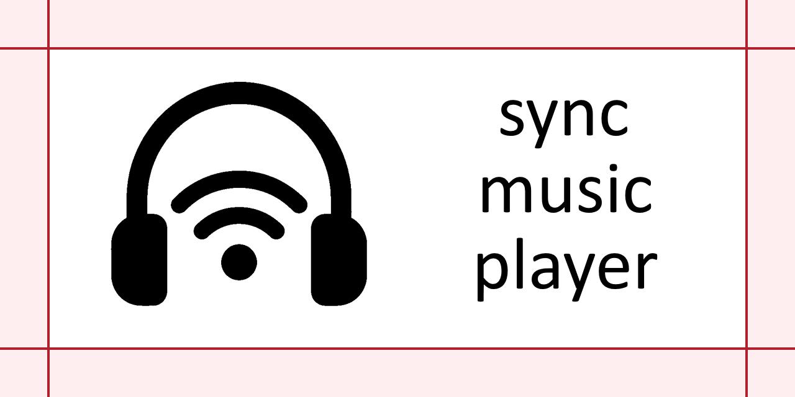

# Sync Music Player

Синхронный музыкальный плеер на `C++20`, `Qt 6` и `CMake`.

Проект выполнен в рамках учебной практики по теме "Синхронный музыкальный плеер". Приложение позволяет одному участнику запускать сессию в роли хоста, а остальным подключаться к ней по сети и слушать тот же трек почти одновременно.



## Что реализовано

- Графическое приложение на `Qt 6 Widgets`
- Сетевая часть на `Qt 6 Network`
- Воспроизведение аудио через `Qt 6 Multimedia`
- Режимы `host` и `user` в одном приложении
- Загрузка локального плейлиста из папки `music`
- Синхронизация плейлиста между участниками сессии
- Передача текущего аудиофайла клиентам
- Управление воспроизведением у хоста: `play/pause`, `stop`, `prev`, `next`
- Перемотка текущего трека
- Регулировка громкости у хоста
- Режимы `autoplay` и `repeat`
- Просмотр списка подключённых пользователей и отключение клиента кнопкой (отправка сообщения `KICK`)
- Отладочные логи сетевого протокола через `--dev` или `--enable-logs`

## Технологии

- `C++20`
- `Qt 6 Widgets`
- `Qt 6 Network`
- `Qt 6 Multimedia`
- `CMake`
- `Ninja`

## Структура проекта

- `src/` - исходные файлы приложения
- `include/` - заголовочные файлы
- `music/` - папка для хранения музыки хоста
- `assets/` - изображения и SVG-ресурсы интерфейса
- `.github/workflows/` - сценарий автоматической сборки и релиза

## Поддерживаемые форматы

Приложение ищет в папке `music` файлы со следующими расширениями:

- `mp3`
- `wav`
- `ogg`
- `flac`
- `aac`
- `m4a`

Поддержка воспроизведения зависит от возможностей `Qt Multimedia` и доступных кодеков в конкретной системе.

## Проверенное окружение

### Windows

Локальная сборка проверена на следующем окружении:

- ОС: `Windows 11 Pro x64`
- Среда: `MSYS2 MINGW64`
- IDE: `Visual Studio Code`
- Компилятор: `GCC 16.1.0`
- CMake: `4.3.4`
- Qt: `6.11.1`

### Ubuntu

Для сборки под `Ubuntu` используется следующий набор пакетов:

- `build-essential`
- `cmake`
- `ninja-build`
- `qt6-base-dev`
- `qt6-base-dev-tools`
- `qt6-multimedia-dev`

В репозитории настроена автоматическая сборка под `ubuntu-latest` через GitHub Actions.

## Сборка на Windows

Рекомендуется использовать терминал `MSYS2 MINGW64` или терминал `VS Code`, настроенный на это окружение.

1. Установить необходимые пакеты:

```bash
pacman -S --needed mingw-w64-x86_64-gcc mingw-w64-x86_64-cmake mingw-w64-x86_64-ninja mingw-w64-x86_64-qt6-base mingw-w64-x86_64-qt6-multimedia
```

2. Перейти в корень проекта и выполнить конфигурацию:

```bash
cmake -S . -B build-windows -G Ninja -DCMAKE_BUILD_TYPE=Release
```

3. Собрать проект:

```bash
cmake --build build-windows
```

4. Запустить приложение:

```bash
./build-windows/sync-music-player.exe
```

Если `cmake` не находит `Qt 6`, можно использовать:

```bash
qt-cmake -S . -B build-windows -G Ninja -DCMAKE_BUILD_TYPE=Release
```

## Сборка на Ubuntu

1. Установить зависимости:

```bash
sudo apt update
sudo apt install build-essential cmake ninja-build qt6-base-dev qt6-base-dev-tools qt6-multimedia-dev
```

2. Выполнить конфигурацию:

```bash
cmake -S . -B build-linux -G Ninja -DCMAKE_BUILD_TYPE=Release
```

3. Собрать проект:

```bash
cmake --build build-linux
```

4. Запустить приложение:

```bash
./build-linux/sync-music-player
```

## Аргументы запуска

- `--music-dir=auto` - искать папку `music` сначала рядом с исполняемым файлом, затем в текущей рабочей директории
- `--music-dir=exe`, `--music-from-exe` - искать `music` только рядом с исполняемым файлом
- `--music-dir=current`, `--music-dir=cwd`, `--music-from-current` - искать `music` только в текущей рабочей директории
- `--enable-logs`, `--dev` - включить логи сетевого протокола
- `-?`, `-h`, `--help` - вывести справку и завершить программу

## Как проверить работу

### На одном компьютере

1. Запустить первый экземпляр приложения.
2. Выбрать роль `host`.
3. Нажать `Start host`.
4. Запустить второй экземпляр приложения.
5. Выбрать роль `user`.
6. Подключиться к адресу `127.0.0.1:54000`.
7. На стороне хоста выбрать трек и запустить воспроизведение.

### По локальной сети

1. Запустить приложение у хоста.
2. Выбрать режим `host`.
3. Указать адрес прослушивания или оставить значение по умолчанию (`0.0.0.0:54000` запускает на всех доступных IP).
4. Узнать локальный IPv4-адрес компьютера хоста.
5. На другом компьютере запустить приложение в режиме `user`.
6. Подключиться к адресу вида `192.168.x.x:54000`.

## Логика работы

- При выборе трека хост синхронизирует плейлист и отправляет клиентам текущий аудиофайл.
- После получения файла клиент отправляет сообщение `READY`.
- Воспроизведение запускается с небольшой задержкой, чтобы участники стартовали почти одновременно.
- При позднем подключении клиент получает актуальное состояние сессии и текущую позицию воспроизведения.

## Ограничения и замечания

- Проект не имеет программное ограничение на колтчесьво участников, бан слушателей или защиту паролем.
- Приложение рассчитано на работу в локальной сети.
- Для корректного воспроизведения аудио в системе должны быть доступны нужные кодеки.
- Linux-сборка не упакована в формат вроде `AppImage` или `.deb`, поэтому на другой системе может понадобиться установленный `Qt 6 runtime`.

## Автоматическая сборка

В репозитории есть workflow [.github/workflows/build-release.yml](.github/workflows/build-release.yml), который:

- собирает проект на `Windows` и `Ubuntu`
- загружает артефакты сборки
- при пуше тега вида `v*` создаёт `GitHub Release`
- прикрепляет архивы для обеих платформ

Пример выпуска тега:

```bash
git tag v1.0.0
git push origin v1.0.0
```

## Участники проекта

- [8В41 Бахтин Максим Максимович](https://github.com/Maxim230106)
- [8В42 Головков Алексей Олегович](https://github.com/K0SHAKk)
